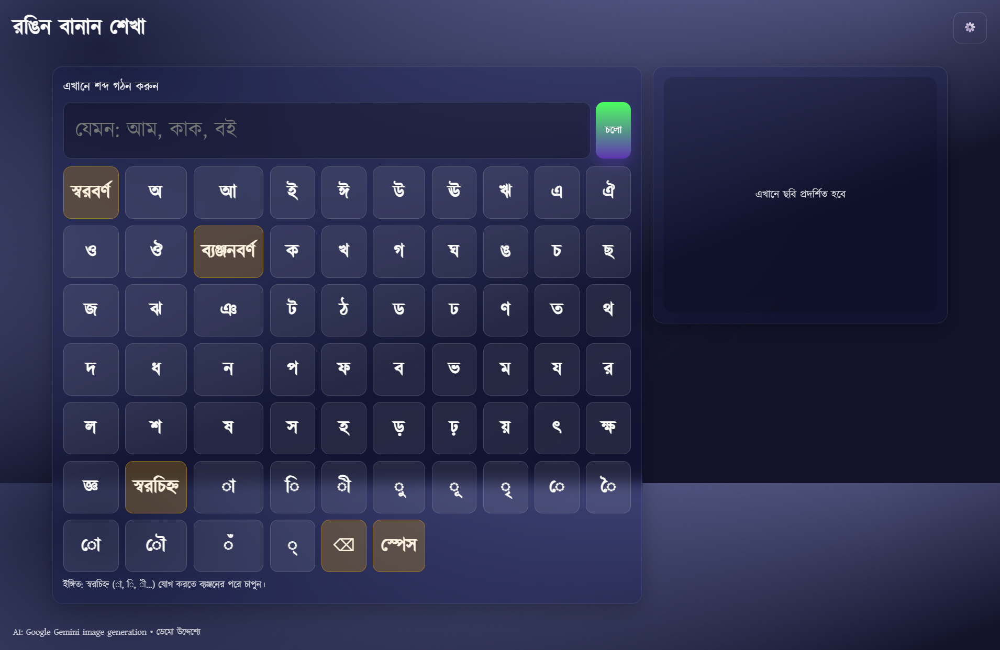

# রঙিন বানান শেখা (Colorful Bengali Spelling Learning App)

A lightweight, kid‑friendly, offline‑first web app to help children (and beginners) learn Bengali spelling through playful typing, instant theming, AI image generation, and text‑to‑speech.

> বাংলা অক্ষর টাইপ করুন ➜ চাইলে ছবিতে দেখুন ➜ শব্দটি শুনুন — সব এক পাতায়!

---
## Table of Contents
1. Overview / সারাংশ
2. Demo Flow
3. Features
4. Screenshots
5. Quick Start
6. Using Gemini (Image + TTS)
7. How It Works (Architecture)
8. Keyboard Layout Details
9. Accessibility & UX Choices
10. Theming & Customization
11. Error Handling & Fallbacks
12. Security Notes (API Keys)
13. Development Guidelines
14. Directory Structure
15. Extending / Future Ideas
16. Troubleshooting
17. License & Attribution
18. বাংলা অংশ (ঐচ্ছিক সারাংশ)

---
## 1. Overview / সারাংশ
A single‑page static app (`index.html`, `styles.css`, `app.js`) providing:
- Virtual Bengali keyboard (স্বাধীন স্বর, ব্যঞ্জন, কার চিহ্ন)
- AI image generation via Google Gemini (streaming parsing)
- Text‑to‑Speech (Gemini TTS → fallback Web Speech API)
- Theme customization (primary color, background, glass blur)
- Local (client‑only) persistence with `localStorage`
- Graceful placeholder image canvas if network/model fails

No build step. No frameworks. Pure, inspectable vanilla code ideal for classrooms, workshops, or rapid prototyping.

---
## 2. Demo Flow
1. Type a Bengali word using on‑screen keys or hardware keyboard.
2. Press “চলো” (Go) → App requests Gemini image if API key is set; else shows informative message.
3. Press “🔊 শুনুন” to hear pronunciation (Gemini TTS if API key present; fallback browser voice if available).
4. Click generated image to view in a modal (zoomed).
5. Open settings (⚙️) to adjust theme or enter/delete API key.

---
## 3. Features
| Category | Highlights |
|----------|-----------|
| Bengali Virtual Keyboard | Vowels, consonants, vowel signs grouped; tap feedback with a tiny oscillator sound. |
| AI Image Generation | Streams Gemini `gemini-2.0-flash-preview-image-generation` (model endpoint inferred) and extracts inline base64 image data from varied JSON shapes (candidates / contents / streaming). |
| Text to Speech | Uses Gemini `gemini-2.5-flash-preview-tts` (audio streaming) → decodes inline data → builds playable object URL; gracefully converts PCM (L16) to WAV if needed. |
| Placeholder Rendering | Canvas gradient + Bengali font draws the typed word if network/model fails. |
| Theming | Adjust primary color, background color, glass blur — all via CSS variables. |
| Persistence | `localStorage` for theme + API key under `bn_app_settings` (JSON). |
| Accessibility | Semantic labels, Bangla UI text, keyboard focus, alt attributes & status messaging. |
| Offline Friendly | Works without network (except AI calls) thanks to inlined keyboard + local font. |
| Zero Dependencies | No external JS libraries; easy to audit & extend. |

---
## 4. Screenshots
(Images included in repository — replace or remove as needed.)

| View | Image |
|------|-------|
| Main Interface |  |
| Generation Example |  |

> Tip: Keep screenshot filenames simple (e.g. `screenshot-main.png`) for cleaner Markdown.

---
## 5. Quick Start
### Option A: Open Directly
Just double‑click `index.html`. (Some browsers may restrict `fetch` for certain APIs under `file://`; prefer Option B for AI features.)

### Option B: Local Dev Server
```bash
# Python (3.x)
python -m http.server -d . 8080
# or
python3 -m http.server -d . 8080

# Then open
http://localhost:8080/
```

### Add Your Gemini API Key
1. Click ⚙️ (Settings).
2. Paste your key into the “Gemini API Key” field (format often starts with `AIza`).
3. Save. The key stays only in your browser’s `localStorage`.
4. Click “চলো” and/or “🔊 শুনুন”.

---
## 6. Using Gemini (Image + TTS)
| Feature | Endpoint (Preview) | Modalities |
|---------|--------------------|-----------|
| Image Generation | `gemini-2.0-flash-preview-image-generation:streamGenerateContent` | IMAGE + TEXT (stream) |
| Bengali TTS | `gemini-2.5-flash-preview-tts:streamGenerateContent` | AUDIO (stream) |

Implementation notes:
- Sends a user prompt: `create image of a "<word>"` for images.
- TTS wraps text into Bangla phrase: `তুমি যা লিখেছ তা হলো, "${text}"`.
- Streaming response parsed line‑by‑line (NDJSON style) extracting `inlineData.data`.
- Supports multiple internal JSON shapes (candidates, serverContent, contents) for robustness.
- Fallback placeholder if no image/audio found or network/HTTP error.

> IMPORTANT: Endpoints / model IDs may change (they are preview). Update in `app.js` accordingly.

---
## 7. How It Works (Architecture)
Single file logic (`app.js`) broken into functional zones:
- Constants: `VOWELS`, `CONSONANTS`, `VOWEL_SIGNS` arrays.
- DOM Cache: `els` object.
- Settings Store: small wrapper around `localStorage` (`bn_app_settings`).
- Theming: `applyTheme()` and `saveSettings()` set CSS custom properties.
- Keyboard Builder: `buildKeyboard()` dynamically creates rows and key buttons.
- Input Helpers: `insertChar`, `backspace`, `keySound`.
- AI Image: `generateImage()` → `fetch` streaming → `extractImageFromAny()`.
- Placeholder: `renderPlaceholder(text)` draws onto canvas.
- TTS: `speakText()` orchestrates; `generateSpeechWithGemini()` handles streaming audio; `extractAudioFromAny()`, `buildAudioUrl()`, `wavBlobFromPCM()` manage formats.
- Dialog Handling: open/close logic for settings and image modal.

All interactions are event‑driven via `addEventListener` at the bottom of the script.

---
## 8. Keyboard Layout Details
Rows rendered in order:
1. Independent vowels (স্বরবর্ণ)
2. Consonants (ব্যঞ্জনবর্ণ)
3. Vowel signs & modifiers (কার / চিহ্ন / হসন্ত)
4. Utility row: Backspace (⌫), Space (স্পেস)

Adding a new character = append to the relevant array and rebuild (app auto‑runs `buildKeyboard()` on load).

---
## 9. Accessibility & UX Choices
| Aspect | Approach |
|--------|----------|
| Labels & Language | All visible UI text in Bangla; `lang="bn"` on `<html>`. |
| Focus & Dialogs | Native `<dialog>` for image & settings (ESC closes). |
| Keyboard Access | Tab focus on major controls; image clickable & keyboard accessible (`Enter` / space). |
| Status Messaging | `setStatus()` updates dynamic text region for guidance / errors. |
| Font Legibility | Local Kalpurush font + fallbacks ensure Bengali glyph consistency. |
| Touch Targets | Generous padding & responsive scaling for small screens. |

Potential improvements: ARIA roles for status region (e.g. `role="status"`), focus trapping inside dialogs, high‑contrast mode toggle.

---
## 10. Theming & Customization
Update via Settings UI or edit `:root` in `styles.css`:
```css
:root {
  --primary: #7c4dff;
  --bg: #0f1020;
  --glass-blur: 10px;
}
```
You can also programmatically set: `document.documentElement.style.setProperty('--primary', '#ff4081')`.

Add new setting? Extend store object & dialog markup; then mirror in `applyTheme()`.

---
## 11. Error Handling & Fallbacks
| Scenario | Behavior |
|----------|----------|
| No API Key | Status message prompting user to open settings. |
| Network / HTTP Error | Placeholder image generated locally; message shown. |
| Streaming Parse Failure | Attempts final buffer parse; else placeholder. |
| No Bangla Voice | Falls back to first available voice or just status error. |
| Audio PCM Format | Wrapped into WAV header dynamically for browser playback. |

---
## 12. Security Notes (API Keys)
- API key stored only in browser `localStorage`; never committed.
- Direct client calls expose the key to anyone using the page. For real deployment:
  1. Move AI calls to a minimal backend proxy.
  2. Enforce rate limiting / origin checks.
  3. Keep keys server‑side and rotate periodically.
- Avoid embedding the key in the source or publishing a public URL with a real key.

---
## 13. Development Guidelines
See also `AGENTS.md` for conventions.
- Style: 2‑space indent, concise functions, no frameworks.
- Commits: Conventional (e.g. `feat: add phonetic hint overlay`).
- Keep UI labels Bangla; keep code comments English (mixed is fine for clarity).
- Test manually: keyboard input, theming, dialogs, AI fallback.
- Add automated tests (if desired) with a lightweight stack (e.g. Vitest + jsdom).

---
## 14. Directory Structure
```
bananApp/
├── AGENTS.md              # Repository / contribution guidelines
├── README.md              # (You are here)
├── index.html             # Single-page app shell
├── styles.css             # Theming + layout + responsive + dialogs
├── app.js                 # Core logic (keyboard, AI, TTS, theming)
├── Kalpurush.ttf          # Bengali font
├── instruction.md         # Example curl script for Gemini TTS (shell-style doc)
├── response.json          # (Placeholder / sample response data if used)
├── Screenshot*.png        # UI screenshots
└── screencapture-*.png    # Additional capture
```

---
## 15. Extending / Future Ideas
| Idea | Description |
|------|-------------|
| Phonetic Input Mapping | Allow Latin transliteration → Bengali letters. |
| Word List Mode | Predefined curriculum list with progress tracking. |
| Spelling Quiz | Random word prompts: user types → validate. |
| Multi‑Image Carousel | Request multiple images; let child pick favorite. |
| Offline Dictionary | Provide definitions / usage sentences (cached JSON). |
| Pronunciation Speed Control | Slider for TTS rate & pitch. |
| Export Artwork | Allow downloading image + overlaid word for printables. |
| PWA Support | Add manifest + service worker for installable offline app. |
| Analytics (Opt‑In) | Track key usage to refine keyboard layout suggestions. |

---
## 16. Troubleshooting
| Problem | Resolution |
|---------|------------|
| No image shows | Ensure API key valid; check DevTools Console for 4xx/5xx; fallback is placeholder. |
| Audio silent | Browser may block autoplay; interact (click) first. Check key & TTS endpoint. |
| Bangla not rendering | Kalpurush font blocked? Confirm font file path & MIME type via server. |
| Keys overlap on small phone | Adjust CSS grid breakpoints (`.key-row`). |
| Dialog not opening | Some older browsers have partial `<dialog>` support; add polyfill if needed. |

---
## 17. License & Attribution
You have NOT explicitly chosen a license yet.
- To open-source broadly, consider adding an OSI-approved license (MIT, Apache-2.0, GPL, etc.).
- Create a `LICENSE` file to formalize usage rights.

Font: `Kalpurush.ttf` — ensure its redistribution complies with its original license (verify before public release).

AI Models: Google Gemini preview endpoints; subject to change & usage limits — abide by Google AI Terms.

If you add third-party assets (audio, images), document them here.

---
## 18. বাংলা অংশ (সারাংশ)
এই অ্যাপটি শিশুদের বাংলা বানান শেখার জন্য তৈরি। কীবোর্ডে অক্ষর চাপুন, "চলো" বাটনে ক্লিক করুন — AI ছবি দেখাবে। "শুনুন" বাটনে চাপলে শব্দটি ধ্বনিতে শোনা যাবে। কোনো সমস্যা বা নেটওয়ার্ক ত্রুটি হলে একটি রঙিন প্লেসহোল্ডার ছবি দেখানো হবে। সেটিংস থেকে রং ও ব্যাকগ্রাউন্ড পরিবর্তন করতে পারবেন এবং Gemini API কী যোগ করতে পারবেন।

---
## Contributing
PRs welcome — keep changes focused and update screenshots if UI meaningfully shifts. Always describe: WHAT changed, WHY, HOW to test.

---
## Maintainer Notes
- Validate endpoints periodically (preview → stable migrations).
- Watch for future Gemini API response shape changes (adjust extractors accordingly).
- Consider refactoring large `app.js` into modules if build tooling ever added.

---
### Quick Reference Commands
```bash
# Start a quick local server (Python 3)
python -m http.server -d . 8080

# (Optional) Format HTML/CSS/JS with an external tool (install first) e.g.
# npx prettier --write index.html styles.css app.js
```

---
### Disclaimer
Educational demo only. Not production‑hardened. Protect real API keys behind a backend if deploying publicly.

---
Happy learning! ✨
